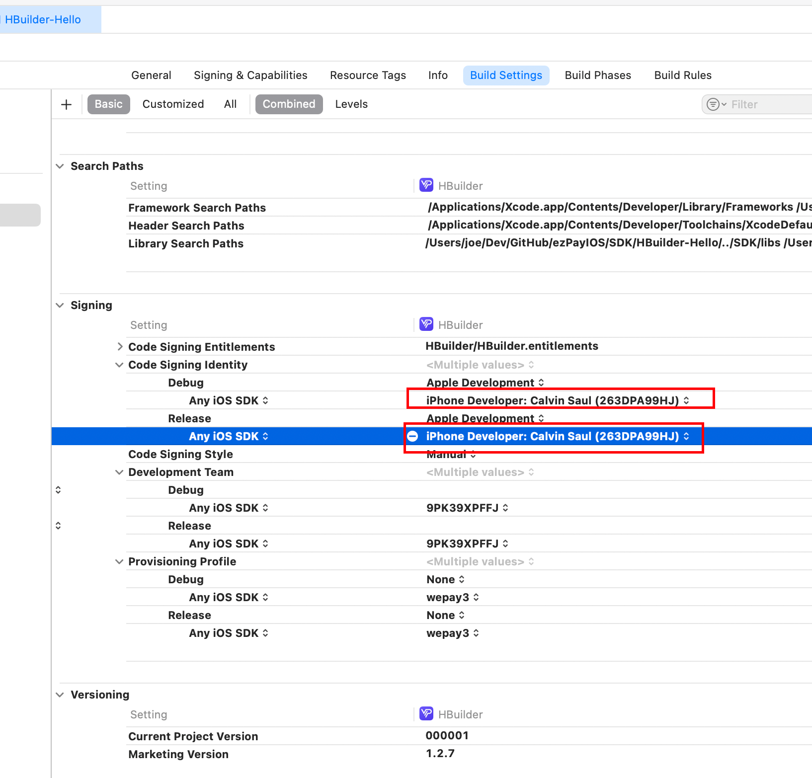

[关于证书参考](https://www.cnblogs.com/allay/p/17545562.html)

AFQ

报错

```
No "iOS Development" signing certificate matching team ID "*****"with a private key was found
```

解决办法：

- 在安装所有的证书以后，点击 `Automatically manage signing` 尝试切换一下。
- 尝试先导出证书为p12文件，然后删除证书，然后重新安装证书从p12文件，重复步骤一
- 钥匙串中点击证书查看详情，信任证书，重复步骤一
- 如下图所示手动指定 证书钥匙串

